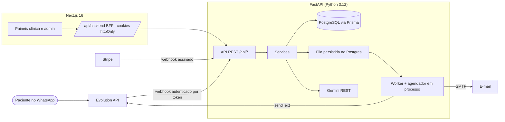

# Secretar.ia

Secretária virtual no WhatsApp para clínicas de saúde e estética: atendimento com IA, agenda, CRM de pacientes,
inbox de transbordo humano e campanha de retorno. SaaS multi-tenant com isolamento por clínica, RBAC, planos e quotas.

## Sumário

- [Arquitetura](#arquitetura)
- [Stack](#stack)
- [Estrutura do repositório](#estrutura-do-repositório)
- [Rodando localmente](#rodando-localmente)
- [Variáveis de ambiente](#variáveis-de-ambiente)
- [Banco de dados e migrations](#banco-de-dados-e-migrations)
- [Testes](#testes)
- [Segurança e multi-tenancy](#segurança-e-multi-tenancy)
- [Integrações](#integrações)
- [Deploy](#deploy)
- [Troubleshooting](#troubleshooting)
- [Decisões arquiteturais](docs/ADR.md)

## Arquitetura



Fluxo de uma mensagem: webhook → idempotência por tenant → verificação de status/plano/quota → paciente →
histórico → IA (JSON validado) → ações (agendamento pendente, cancelamento, transbordo) → memória e log de
execução → resposta enfileirada → worker envia via Evolution API com retry/backoff.

## Stack

| Camada | Tecnologia |
| --- | --- |
| Backend | Python 3.12, FastAPI, Prisma Client Python, PyJWT, bcrypt, httpx, aiosmtplib |
| Banco | PostgreSQL 16 (migrations Prisma) |
| Frontend | Next.js 16 (App Router), React 19, Tailwind CSS 4, TypeScript |
| IA | Google Gemini (REST) com fallback determinístico por regras |
| WhatsApp | Evolution API (QR Code, envio, webhook) |
| Billing | Stripe (webhooks assinados) |
| Infra | Docker, GitHub Actions, uv |

## Estrutura do repositório

```
backend/
  app/
    api/           rotas: auth, admin, clinic, webhooks, internal (health/cron)
    services/      regras de negócio (auth, tenants, conversation, ai, appointments, patients, team, billing...)
    integrations/  clientes externos encapsulados (whatsapp, gemini, email)
    jobs/          fila persistida (SKIP LOCKED), tarefas e agendador diário
    security/      senhas, tokens, assinaturas HMAC, rate limit
    domain/        RBAC, planos/quotas, intenções, telefones
    config.py      settings validadas (fail-fast em produção)
    deps.py        autenticação e isolamento de tenant
    main.py        app factory, middlewares, handlers de erro
    cli.py         create-superadmin, seed-demo
  prisma/          schema.prisma + migrations/
  tests/           unit/ e integration/ (PostgreSQL real)
web/
  src/app/         rotas: (auth), app/[tenantId]/*, admin/*, account, api/backend/[...path]
  src/components/  shell, primitivos de UI, gráficos, sessão
  src/lib/         cliente de API, tipos, formatação, hooks
  src/proxy.ts     proteção de rotas (redirect sem sessão)
docker-compose.yml postgres (+ backend com --profile full)
```

## Rodando localmente

Pré-requisitos: Docker, [uv](https://docs.astral.sh/uv/), Node 20+.

```bash
# 1. Banco
docker compose up -d postgres

# 2. Backend
cd backend
cp .env.example .env            # ajuste DATABASE_URL se necessário
uv sync
uv run prisma generate --schema=prisma/schema.prisma
uv run prisma migrate deploy --schema=prisma/schema.prisma
uv run python -m app.cli seed-demo                      # opcional: clínica demo (dona@harmonize.demo / Demo12345)
uv run python -m app.cli create-superadmin --email admin@exemplo.com --password 'Troque-1234' --name Admin
uv run uvicorn app.main:app --reload --port 8000

# 3. Frontend
cd ../web
cp .env.example .env.local      # API_URL=http://localhost:8000
npm ci
npm run dev                     # http://localhost:4000
```

> Windows com nome de usuário acentuado: prefixe os comandos `prisma` e `pytest` com `PYTHONUTF8=1`
> (o gerador do Prisma lê o caminho via stdin e falha com mojibake sem isso).

Sem `GEMINI_API_KEY`, a IA opera em **modo degradado por regras** (intenção por palavras-chave e respostas
com os dados da clínica); isso é registrado em `ExecutionLog.error = ai_not_configured`. Sem
`EVOLUTION_API_URL` em desenvolvimento, mensagens são apenas logadas (provider console). Em produção, ambas
as ausências são erros explícitos, nunca sucesso silencioso.

## Variáveis de ambiente

Backend (`backend/.env.example`):

| Variável | Obrigatória em produção | Descrição |
| --- | --- | --- |
| `APP_ENV` | sim | `development`, `test`, `staging`, `production` |
| `DATABASE_URL` | sim | PostgreSQL |
| `JWT_SECRET` | sim (≥ 32 chars) | assinatura dos access tokens |
| `CORS_ORIGINS` | sim | origens do frontend, separadas por vírgula (nunca `*`) |
| `FRONTEND_URL` / `PUBLIC_API_URL` | sim | links de e-mail e URL do webhook da Evolution |
| `WHATSAPP_APP_SECRET` | sim | HMAC do webhook normalizado |
| `EVOLUTION_API_URL` / `EVOLUTION_API_KEY` / `EVOLUTION_WEBHOOK_TOKEN` | para WhatsApp real | Evolution API |
| `GEMINI_API_KEY` / `GEMINI_MODEL` | para IA real | Google Gemini |
| `STRIPE_WEBHOOK_SECRET` | para billing | assinatura dos webhooks Stripe |
| `CRON_SECRET` | sim | `Authorization: Bearer` dos endpoints `/api/internal/cron/*` |
| `SMTP_*` | para e-mail real | transacional (verificação, reset, convites) |
| `SUPER_ADMIN_EMAIL` | não | promove este e-mail a SUPER_ADMIN na inicialização |

Frontend (`web/.env.example`): `API_URL` (somente servidor) e `COOKIE_SECURE`.

A aplicação **se recusa a iniciar** em `staging`/`production` sem `JWT_SECRET`, `WHATSAPP_APP_SECRET` e
`CRON_SECRET`, ou com `*` em `CORS_ORIGINS`.

## Banco de dados e migrations

- Schema em `backend/prisma/schema.prisma`; migrations versionadas em `backend/prisma/migrations/`.
- Criar migration após alterar o schema: `uv run prisma migrate dev --name <descricao>`.
- Aplicar em produção: `uv run prisma migrate deploy` (o Dockerfile faz isso no start).
- O CI falha se schema e migrations divergirem.
- Índices por tenant em todas as tabelas de negócio; FKs com `onDelete: Cascade` a partir de `Tenant`.

## Testes

```bash
cd backend
PYTHONUTF8=1 uv run pytest -q          # unitários + integração (usa secretaria_test, migra automaticamente)
uv run ruff check . && uv run ruff format --check .

cd web
npm run lint && npm run typecheck && npm run build
```

A suíte de integração **trunca as tabelas** e por isso só roda em um banco cujo nome contenha `_test`
(`ALLOW_NON_TEST_DB=1` para forçar). Cobre: cadastro/login/refresh rotativo/logout, verificação de e-mail e
reset de senha, **isolamento entre tenants (leitura, escrita e IDOR)**, RBAC por papel, admin exige
SUPER_ADMIN validado no banco, webhooks (assinatura obrigatória, idempotência por tenant, bloqueio por
status/quota), Evolution (token + instância), Stripe (assinatura, idempotência, status), fila (claim atômico,
falha permanente, recuperação de jobs presos), campanha de upsell, CRUD de agenda/pacientes e limites de plano.

## Segurança e multi-tenancy

- Modelo: `User` → `Membership(role)` → `Tenant` → dados. Papéis por clínica: `OWNER`, `MANAGER`, `STAFF`;
  papel de plataforma `SUPER_ADMIN` (não é membro implícito de nenhuma clínica).
- O tenant vem **sempre da URL** (`/api/clinic/{tenantId}/...`) e é validado contra a membership do usuário.
  Sem membership → 404 (não revela existência). Permissões por papel em `app/domain/roles.py`.
- Access token JWT de 15 min; refresh token opaco (hash SHA-256 no banco) de 30 dias com **rotação** e
  detecção de reuso (revoga a família). Senhas com bcrypt; política mínima; timing constante no login.
- Frontend nunca vê tokens: BFF em `/api/backend/*` guarda-os em cookies `httpOnly`; `API_URL` não é público.
- Webhooks: WhatsApp normalizado exige `X-Hub-Signature-256` (HMAC), Evolution exige token secreto na URL,
  Stripe exige `Stripe-Signature` com tolerância de 5 min. Todos idempotentes.
- Erros nunca expõem stack trace; envelope `{error: {code, message, request_id}}`. Logs JSON com request id,
  tenant e usuário; dados sensíveis são mascarados.
- Rate limit em login/cadastro/recuperação de senha (memória; troque por Redis com múltiplas réplicas).
- Auditoria (`AuditLog`) de ações relevantes: quem, o quê, recurso, quando, IP.
- Cabeçalhos de segurança no Next (CSP, `X-Frame-Options`, etc.) e no FastAPI.

## Integrações

| Integração | Onde | Comportamento |
| --- | --- | --- |
| Evolution API | `integrations/whatsapp.py` | criar instância + QR, estado da conexão, envio; timeouts; 429/5xx → retry na fila |
| Gemini | `integrations/gemini.py`, `services/ai.py` | JSON com schema, timeout, limite de tokens, instruções anti-injeção, fallback por regras |
| Stripe | `api/webhooks.py`, `services/billing.py` | eventos de assinatura/fatura → status e plano do tenant (metadata `tenantId`/`plan`) |
| SMTP | `integrations/email.py` | verificação, reset de senha e convites via fila |

Configuração do webhook na Evolution: `POST {PUBLIC_API_URL}/api/webhooks/evolution/{EVOLUTION_WEBHOOK_TOKEN}`
com eventos `MESSAGES_UPSERT` e `CONNECTION_UPDATE` (feito automaticamente ao criar a instância pelo painel).

## Deploy

Backend (qualquer host de containers: Railway, Fly.io, Render, ECS):

1. Provisione PostgreSQL e defina as variáveis acima com `APP_ENV=production`.
2. Build da imagem `backend/Dockerfile`; o `CMD` aplica `prisma migrate deploy` e sobe o Uvicorn.
   Health check em `GET /health`. Rode **uma** réplica com worker ou mantenha várias: o claim de jobs usa
   `FOR UPDATE SKIP LOCKED` e o agendador usa advisory lock.
3. Crie o primeiro admin: `python -m app.cli create-superadmin ...` (ou `SUPER_ADMIN_EMAIL`).
4. Aponte o webhook do Stripe para `/api/webhooks/billing` e configure `STRIPE_WEBHOOK_SECRET`.
5. Opcional: cron externo chamando `POST /api/internal/cron/daily` com `Authorization: Bearer $CRON_SECRET`
   (o agendador interno já roda às 12:00 UTC).

Frontend (Vercel ou Node): defina `API_URL` (URL pública do backend) e `COOKIE_SECURE=true`; adicione a URL
do frontend em `CORS_ORIGINS` e `FRONTEND_URL` do backend.

Ambientes: use bancos e segredos distintos para `development`, `staging` e `production`; nunca reutilize
`JWT_SECRET`.

## Troubleshooting

| Sintoma | Causa provável | Ação |
| --- | --- | --- |
| `Variáveis obrigatórias ausentes em production` | fail-fast de configuração | defina os segredos listados |
| Paciente não recebe resposta | tenant `PAST_DUE`/trial vencido/quota | veja Inbox (notificação BILLING) e `ExecutionLog` |
| `degraded: true` no webhook | `GEMINI_API_KEY` ausente ou Gemini indisponível | fallback por regras ativo; verifique a chave |
| Jobs em `FAILED` | integração recusou (permanente) | Admin → Fila de tarefas → detalhe do erro → reprocessar |
| `prisma generate` com `PermissionError`/mojibake no Windows | caminho com acento | `PYTHONUTF8=1` |
| 401 em loop no frontend | cookies bloqueados ou `API_URL` errado | confira `.env.local` e `COOKIE_SECURE` |

## Licença

MIT. Veja `LICENSE`.
