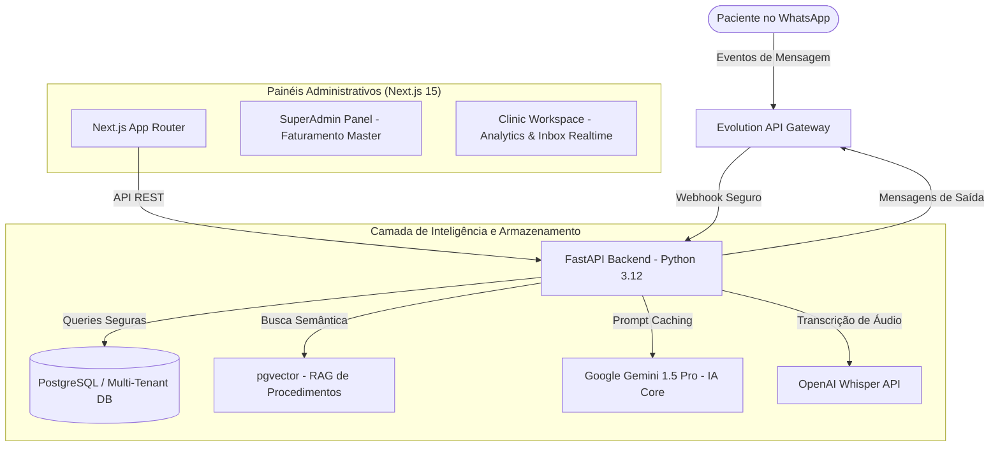

# 🤖 Secretar.ia — AI-Powered Multi-Tenant SaaS for High-Ticket Clinics

**Secretar.ia** é uma plataforma SaaS empresarial de inteligência artificial voltada para clínicas de saúde e estética de alto padrão (*high-ticket*). O sistema gerencia de forma 100% autônoma a captação, o agendamento de consultas e a retenção ativa de clientes diretamente via WhatsApp.

Desenhada sob o conceito de **Zero-Touch Onboarding**, a plataforma permite que as clínicas se cadastrem, realizem o login social via Google (para integração do Calendar com OAuth2) e conectem seus números de WhatsApp via QR Code de forma self-service, eliminando gargalos de suporte técnico e garantindo escalabilidade linear para o modelo de negócios.

---

## 📐 Visão Geral da Arquitetura

O sistema é baseado em microsserviços integrados, acoplados a um banco de dados relacional robusto com isolamento de dados por inquilino (`tenantId`).



---

## 💎 Pilares do Produto (SaaS Enterprise)

### 1. Inteligência Conversacional & Performance
*   **Prompt Caching**: Otimização avançada de tokens que mantém as regras de funcionamento e tabela de preços da clínica em cache na API do LLM, gerando respostas em menos de 2 segundos e reduzindo custos operacionais em até 80%.
*   **RAG de Alta Fidelidade (pgvector)**: Busca semântica local no PostgreSQL para entregar descrições precisas de tratamentos, restrições e preços da clínica sem sobrecarregar o prompt principal da IA.
*   **Recepção Multimodal**: Leitura autônoma de mensagens de áudio (Whisper) e avaliação inteligente de fotos da pele enviadas por pacientes (Gemini Vision) para pré-avaliar a necessidade de tratamentos estéticos.

### 2. Retorno Financeiro Comprovado (ROI Dashboard)
*   **Visualização de Lucro Recuperado**: O painel das clínicas exibe de forma clara e objetiva o faturamento estimado recuperado pelo robô (agendamentos de pacientes reativados) versus o custo de assinatura do SaaS.
*   **Máquina de Upsell Ativa (Cron Preditivo)**: Motor em lote que monitora o tempo de vencimento de tratamentos periódicos (como Toxina Botulínica após 5 meses) e reengaja a paciente no WhatsApp sugerindo um horário de retorno de forma amigável.

### 3. Onboarding Self-Service Autônomo
*   **Integração Google Calendar (OAuth2)**: A própria clínica autoriza e sincroniza suas agendas do Google Workspace com a plataforma em um clique.
*   **Emparelhamento de WhatsApp (QR Code)**: Conexão via painel escaneando o QR Code dinâmico da Evolution API, permitindo ativação instantânea do chatbot.

### 4. Robustez e Resiliência Técnica
*   **Idempotência de Webhooks**: Sistema que valida e registra identificadores únicos de mensagens, descartando qualquer webhook duplicado enviado pela Meta e evitando envios repetidos para o paciente.
*   **Fila Assíncrona com Backoff Exponencial**: Gerenciador de fila persistido no PostgreSQL que reprocessa falhas de API externas automaticamente, dobrando o tempo de espera a cada tentativa (ex: rate limits do WhatsApp ou quedas do Google Calendar).
*   **Validação Criptográfica**: Checagem SHA-256 HMAC das requisições recebidas da Meta para garantir a autenticidade e segurança de ponta a ponta.

---

## 💻 Stack Tecnológica

*   **Painéis Web**: Next.js 15, React 19, Tailwind CSS 4, Shadcn/UI (Design moderno com Glassmorphism, Dark Mode e animações fluidas).
*   **Backend Core**: Python 3.12, FastAPI (Assíncrono com Uvicorn).
*   **Banco de Dados & ORM**: PostgreSQL, Prisma Client Python (`prisma-client-py`) com injeção de dependência e suporte a driver adapters de alto desempenho.
*   **Automação de Eventos**: Evolution API Gateway.

---

## 📂 Estrutura do Repositório

```
secretar.ia/
├── backend/            # API FastAPI em Python
│   ├── core/           # Motores Críticos (Idempotência, Fila, Segurança, Roteador)
│   ├── routes/         # Endpoints de Negócio (Admin, Clinic, Webhook, Cron)
│   ├── prisma/         # Prisma Schema (Banco PostgreSQL)
│   └── generated_prisma/ # Cliente Python Autogerado do Prisma
├── web/                # Frontend Next.js 15 (Tailwind Glassmorphism)
│   ├── src/app/        # Páginas do Painel Admin e Clinic Workspace
└── docker-compose.yml  # Orquestração do banco Postgres + MySQL + N8n
```
