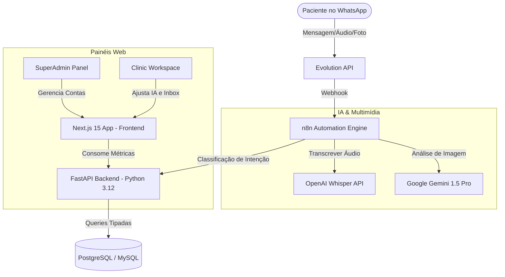

# 🤖 Secretar.ia — AI-Powered Multi-Tenant SaaS for High-Ticket Clinics

[](https://nextjs.org)
[](https://fastapi.tiangolo.com)
[](https://prisma-client-py.readthedocs.io)
[](https://n8n.io)
[](https://docker.com)

**Secretar.ia** é uma plataforma SaaS híbrida (TypeScript/Python) de agendamento, atendimento e retenção de pacientes voltada para clínicas de estética de alto padrão (*high-ticket*). O sistema atua de forma 100% autônoma através do WhatsApp, integrando fluxos inteligentes de IA com painéis modernos de gerenciamento.

---

## 📐 Arquitetura do Sistema

O projeto é estruturado em três camadas independentes:



---

## 🌟 Principais Funcionalidades (Enterprise)

1. **Recepção Multimodal Avançada**:
   *   **Transcrição de Áudio (Whisper)**: A IA baixa mensagens de voz de pacientes, converte em texto em milissegundos e processa o agendamento de forma natural.
   *   **Visão Computacional (Gemini)**: Pacientes podem enviar fotos da pele/rosto. O robô analisa, faz uma leitura gentil e sugere o agendamento de uma consulta presencial.
2. **Máquina de Upsell & Retenção (Cron)**:
   *   Um robô varre o banco de dados todas as manhãs buscando pacientes que fizeram aplicação de Botox há exatos **5 meses** e dispara uma notificação ativa no WhatsApp convidando-as para o retoque.
3. **Faturamento SaaS Centralizado (Billing Webhook)**:
   *   Mecanismo de controle financeiro pronto para integrar com Stripe ou Asaas. Se a assinatura da clínica falhar, o acesso à IA do WhatsApp é pausado na mesma hora.
4. **Inbox de Transbordo (Handoff em Tempo Real)**:
   *   Quando a IA bate na intenção de "Humano", ela apita no painel do Next.js em tempo real para a recepcionista física assumir a conversa sem perder o lead.

---

## 🛠️ Tecnologias Utilizadas

*   **Frontend**: Next.js 15 (App Router), React 19, Tailwind CSS 4, Shadcn/UI (Design de Vidro/Glassmorphism).
*   **Backend**: Python 3.12, FastAPI (Assíncrono), Pydantic v2.
*   **ORM**: Prisma Client Python (`prisma-client-py`) com suporte nativo a migrações em PostgreSQL e MySQL.
*   **Automação**: N8n (Especificações completas salvas em `/n8n-specs`).
*   **Ambiente**: Docker Compose contendo bancos PostgreSQL, MySQL e servidor local N8n prontos para rodar.

---

## 🚀 Setup Rápido (Ambiente Local)

### Requisitos:
*   [Docker & Docker Compose](https://www.docker.com/) instalado.
*   [uv](https://github.com/astral-sh/uv) (gerenciador de pacotes Python super rápido).
*   Node.js 20+.

### Passo 1: Subir os Bancos de Dados e N8n
Na raiz do repositório, rode:
```bash
docker compose up -d
```
Isso iniciará:
*   **PostgreSQL** na porta `5432`
*   **MySQL** na porta `3306`
*   **N8n Local** na porta `5678`

### Passo 2: Configurar e Iniciar o Backend (Python)
1. Navegue até a pasta do backend:
   ```bash
   cd backend
   ```
2. Instale as dependências usando o `uv`:
   ```bash
   uv venv --python 3.12
   uv pip install fastapi uvicorn prisma
   ```
3. Copie o arquivo `.env.example` para `.env` e configure suas chaves.
4. Gere o Prisma Client para o Python:
   ```bash
   uv run prisma generate
   ```
5. Rode a API:
   ```bash
   uv run uvicorn main:app --reload --port 8000
   ```

### Passo 3: Configurar e Iniciar o Frontend (Next.js)
1. Abra um novo terminal na pasta `web`:
   ```bash
   cd web
   ```
2. Instale as dependências e inicie:
   ```bash
   npm install
   npm run dev
   ```
3. Abra **http://localhost:4000** no seu navegador para ver o dashboard em funcionamento.

---

## 📂 Estrutura do Repositório

```
secretar.ia/
├── backend/            # API Python FastAPI
│   ├── routes/         # Roteadores de Negócio (Admin, Clinic, Billing, Cron)
│   ├── prisma/         # Prisma Schema (PostgreSQL/MySQL)
│   └── generated_prisma/ # Cliente Python Autogerado do Prisma
├── web/                # Frontend Next.js 15 (Tailwind Glassmorphism)
│   ├── src/app/        # Páginas do Painel Admin e Clinic Workspace
├── n8n-specs/          # Especificações dos fluxos N8n (.md e diagramas)
└── docker-compose.yml  # Orquestração do banco Postgres + MySQL + N8n
```

---

## 📄 Licença

Este projeto está sob a licença MIT. Veja o arquivo [LICENSE](LICENSE) para mais detalhes.
